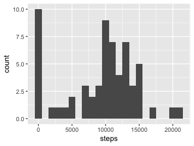
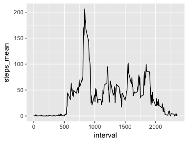
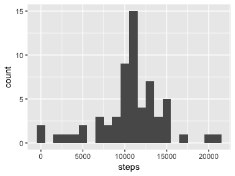
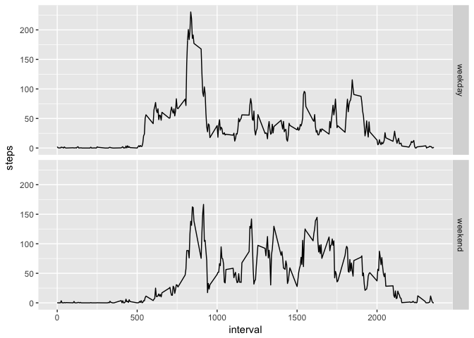

# Reproducible Research: Peer Assessment 1


## Loading and preprocessing the data

```r
library(readr)
activity <- read_csv("activity.csv", col_types = cols())
```


## What is mean total number of steps taken per day?

#### Number of steps taken each day


```r
suppressMessages(library(dplyr))

steps_per_day <- activity %>% 
  group_by(date) %>% 
  summarise(steps = sum(steps, na.rm = TRUE))

steps_per_day
```

```
## # A tibble: 61 x 2
##          date steps
##        <date> <int>
##  1 2012-10-01     0
##  2 2012-10-02   126
##  3 2012-10-03 11352
##  4 2012-10-04 12116
##  5 2012-10-05 13294
##  6 2012-10-06 15420
##  7 2012-10-07 11015
##  8 2012-10-08     0
##  9 2012-10-09 12811
## 10 2012-10-10  9900
## # ... with 51 more rows
```

#### Histogram of daily steps taken


```r
library(ggplot2)

qplot(x = steps, data = steps_per_day, binwidth = 1000)
```

<!-- -->

#### Basic statistics of daily steps taken


```r
median_step <- steps_per_day$steps %>% median() 
mean_step   <- steps_per_day$steps %>% mean()
```

- Median: 10395
- Mean:   9354.23

## What is the average daily activity pattern?

#### Time series plot of steps average per interval


```r
interval_mean <- activity %>% 
  group_by(interval) %>% 
  summarise(steps_mean = mean(steps, na.rm = TRUE))

qplot(x = interval, y = steps_mean, data = interval_mean, geom = "line")
```

<!-- -->

#### Interval with the highest average steps


```r
most_active <- interval_mean %>% 
  arrange(desc(steps_mean)) %>% 
  slice(1)
```

Interval 835 had the highest average steps taken with
206.17 steps.

## Imputing missing values


```r
na_row <- activity$steps %>% is.na() %>% sum()
```

Number of rows that contain missing values for steps (`NA`) is 2304.

I will replace the missing values with the average value for that interval.


```r
activity_imputed <- activity %>% 
  left_join(interval_mean, by = "interval") %>% 
  mutate(steps = ifelse(is.na(steps), steps_mean, steps)) %>% 
  select(-steps_mean)
```

#### Measuring the effect of imputing


```r
steps_per_day_imputed <- activity_imputed %>% 
  group_by(date) %>% 
  summarise(steps = sum(steps, na.rm = TRUE))

qplot(x = steps, data = steps_per_day_imputed, binwidth = 1000)
```

<!-- -->


```r
library(knitr)

median_step_imputed <- steps_per_day_imputed$steps %>% median()
mean_step_imputed   <- steps_per_day_imputed$steps %>% mean()

impute_change <- tribble(
  ~stat,     ~pre_impute_val,  ~post_impute_val,
  "mean",    mean_step,        mean_step_imputed,
  "median",  median_step,      median_step_imputed
) %>% 
  mutate(diff = post_impute_val - pre_impute_val) %>% 
  select(`Statistic` = stat, `Pre Impute Value` = pre_impute_val,
         `Post Impute Value` = post_impute_val, `Difference` = diff)

kable(impute_change, row.names = FALSE)
```


Statistic    Pre Impute Value   Post Impute Value   Difference
----------  -----------------  ------------------  -----------
mean                  9354.23            10766.19    1411.9592
median               10395.00            10766.19     371.1887

After imputing, the mean increased considerably. Also the histogram became
more normalized. Missing values were decreasing the mean and median because some 
days had 0 steps in result of them.

## Are there differences in activity patterns between weekdays and weekends?


```r
day_type_mean <- activity_imputed %>% 
  mutate(day_type = ifelse(weekdays(date) %in% c("Saturday", "Sunday"), 
                           "weekend",
                           "weekday")) %>% 
  mutate(day_type = as.factor(day_type)) %>% 
  group_by(interval, day_type) %>% 
  summarise(steps = mean(steps))

qplot(x = interval, y = steps, data = day_type_mean, geom = "line") +
  facet_grid(day_type ~ .)
```

<!-- -->

Activity seems to start earlier in the week days.
